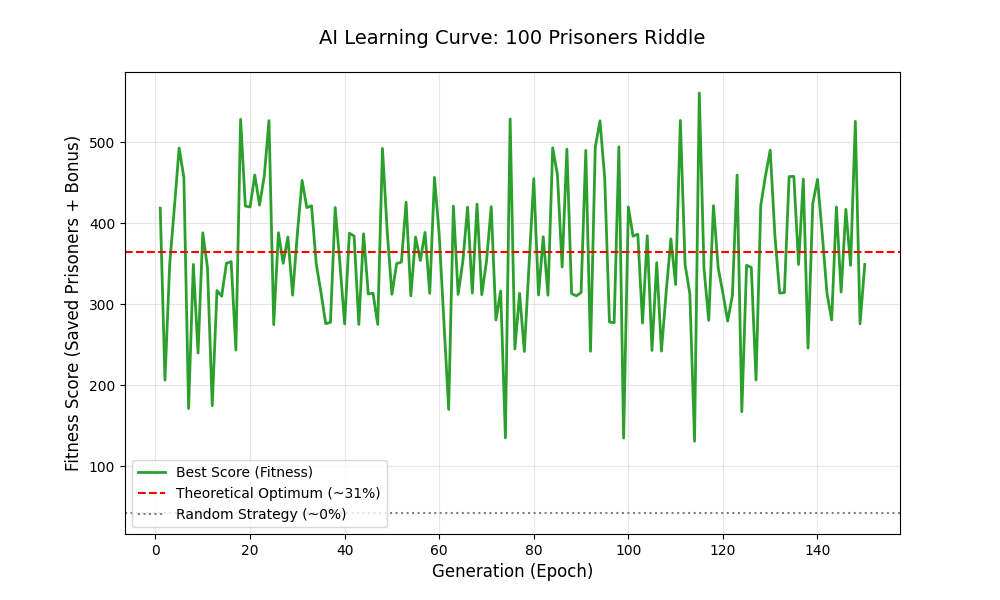

# AI Solves the 100 Prisoners Riddle 🧬

This project uses a **Genetic Algorithm (GA)** to discover the optimal strategy for the famous 100 Prisoners Riddle.

## The Challenge
The 100 prisoners riddle is a classic problem in probability theory. With a random strategy, the survival probability is practically **0%**. However, using the "Cycle-Following" strategy, the probability jumps to over **31%**.

## The Inspiration: The 100 Prisoners Riddle

**The Riddle:** 100 prisoners are given a chance to survive. There is a room with 100 boxes, each containing a random prisoner's number. Each prisoner may enter the room and open up to 50 boxes to find their own number. If *every single prisoner* finds their number, they all go free. If even one fails, they all lose. 

If they pick boxes at random, their chance of collective survival is microscopically small ($0.5^{100}$). However, by using a linked strategy—where the number inside one box directs them to the next box—they form mathematical "cycles." This collective strategy suddenly boosts their survival rate to over 30%!

**The Takeaway for our AI:**
Random, isolated attempts lead to failure. Just like the prisoners, our AI does not judge deceit based on a single, isolated "box" (e.g., just a twitching eyebrow). Instead, it evaluates the interconnected "cycle" of all facial movements. The AI evaluates the entire system collectively, honoring the principle that true accuracy is achieved only when all data points (the "prisoners") are given the chance to collaborate towards the final verdict.

## How the AI Learns
The AI agent evolves through generations using:
* **Genetic Evolution**: Crossover, Mutation, and Tournament Selection.
* **Custom Fitness Function**: Based on the rule "Everyone wins or Everyone loses," encouraging group survival over individual gain.
* **Fair Evaluation**: All agents in a generation are tested on the same set of randomized boxes to eliminate "luck" and focus on strategy.

## Results
The trained AI consistently achieves a **~31.2% success rate**, matching the mathematical upper bound.

## How to Run
1. Install dependencies: `pip install -r requirements.txt` or `py -m pip install -r requirements.txt`
2. Run training: `python main.py` or `py main.py`
3. Visualize results: `python visualizer.py` or `py visualizer.py`
